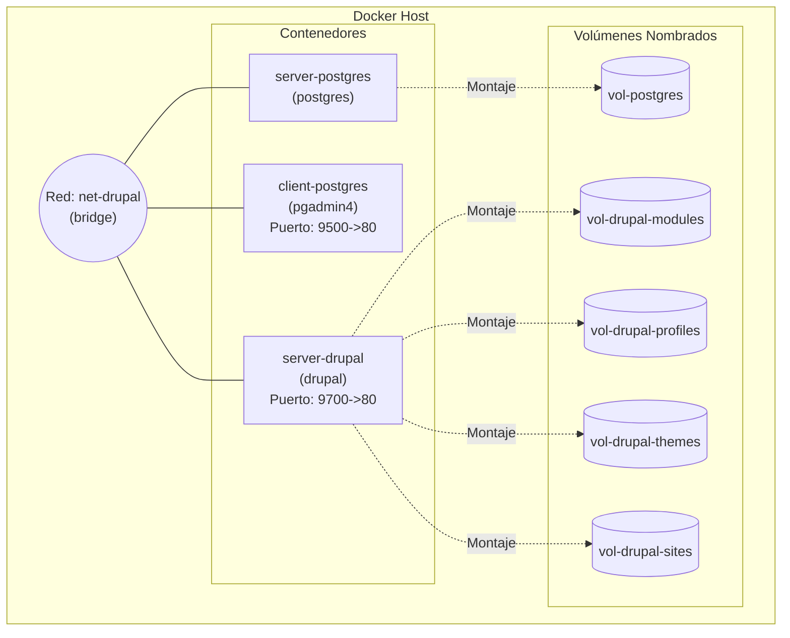

# Resolución de la Práctica 3: Volúmenes en Docker

A continuación, se presentan las respuestas y los comandos solicitados para completar los ejercicios planteados en los documentos correspondientes del 1 al 5.

## 2. Bind Mount (`2-bind-mount.md`)

- **Línea 19 - Crear contenedor con Nginx y Bind mount:**
  ```bash
  docker run -d --name mi_nginx -P -v "$(pwd)/nginx/html:/usr/share/nginx/html" nginx:alpine
  ```
  *(Nota: Se utiliza `$(pwd)` o puede reemplazar con la ruta absoluta local donde ubicó físicamente la carpeta `nginx/html`)*.

- **Línea 22 - ¿Qué sucede al ingresar al servidor de nginx?**
  Al ingresar, se muestra un error de tipo "403 Forbidden" (o la página no se encuentra). Esto ocurre porque la carpeta local `html` que hemos montado hacia el contenedor está completamente vacía y sobreescribe (u oculta) lo que estaba por defecto en ella.

- **Línea 25 - ¿Qué pasa con el archivo index.html del contenedor?**
  El archivo `index.html` original de Nginx que venía con el contenedor queda subyacente o temporalmente inaccesible. El directorio del host domina sobre su comportamiento al usar un bind mount.

- **Línea 29 - ¿Qué sucede al ingresar al servidor de nginx tras descargar el template?**
  El servidor exhibe inmediatamente el sitio web y el diseño del template que se acaba de descargar y descomprimir, ya que Nginx se encarga de servir los archivos que el host está compartiendo con el contenedor en tiempo real.

- **Línea 32 - Eliminar el contenedor:**
  ```bash
  docker rm -f mi_nginx
  ```

- **Línea 35 - ¿Qué sucede al crear nuevamente un contenedor montado al directorio definido anteriormente?**
  El nuevo contenedor mostrará el sitio web del template, lo que demuestra claramente que los datos persisten, se mantienen en el disco de nuestro host propio e independiente del ciclo de vida que tengan los contenedores asociados a él.


## 3. Ejercicio Práctico (`3-ejercicio.md`)

- **Línea 5 - Crear red net-wp:**
  ```bash
  docker network create net-wp
  ```

- **Línea 9 - Ruta del contenedor MySQL:**
  En el esquema del ejercicio la carpeta del contenedor (a) es `/var/lib/mysql`

- **Línea 14 - ¿Qué contiene la carpeta db del host?**
  Se encuentra o debería de encontrarse completamente vacía al inicio.

- **Línea 17 - Crear un contenedor con la imagen mysql:8:**
  ```bash
  docker run -d --name mi_mysql --network net-wp -e MYSQL_ROOT_PASSWORD=root -e MYSQL_DATABASE=wordpress_db -e MYSQL_USER=wp_user -e MYSQL_PASSWORD=wp_pass -v "$(pwd)/ejercicio3/db:/var/lib/mysql" mysql:8
  ```

- **Línea 20 - ¿Qué observa en la carpeta db que se encontraba inicialmente vacía?**  
  Aparecen todos los sistemas de archivos base, subdirectorios y componentes internos o las tablas que MySQL genera al ser inicializado para una base de datos nueva; demostrando su persistencia.

- **Línea 24 - Ruta del contenedor WordPress:**
  En el esquema del ejercicio la carpeta del contenedor (b) es `/var/www/html`

- **Línea 29 - Crear un contenedor con la imagen wordpress en la red net-wp:**
  ```bash
  docker run -d --name mi_wordpress --network net-wp -p 8080:80 -e WORDPRESS_DB_HOST=mi_mysql -e WORDPRESS_DB_USER=wp_user -e WORDPRESS_DB_PASSWORD=wp_pass -e WORDPRESS_DB_NAME=wordpress_db -v "$(pwd)/ejercicio3/www:/var/www/html" wordpress
  ```

- **Línea 35 - Eliminar el contenedor y crearlo nuevamente, ¿qué ha sucedido?**
  La instalación de WordPress, sus configuraciones, artículos y modificaciones visuales previamente elaboradas no se pierden y continúan operando normalmente en el siguiente arranque, gracias los datos base que se conservaron en nuestra máquina a través de la carpeta `db` y los archivos estáticos en `www`.


## 4. Volumen Nombrado (`4-volumen-nombrado.md`)

- **Línea 11 - Crear el volumen nombrado: vol-postgres:**
  ```bash
  docker volume create vol-postgres
  ```

- **Línea 42 - Crear la red net-drupal de tipo bridge:**
  ```bash
  docker network create --driver bridge net-drupal
  ```

- **Línea 44 - Modificación o corrección al comando del servidor postgres para utilizar el volumen recién estipulado:**
  ```bash
  docker run -d --name server-postgres -e POSTGRES_DB=db_drupal -e POSTGRES_PASSWORD=12345 -e POSTGRES_USER=user_drupal -v vol-postgres:/var/lib/postgresql/data --network net-drupal postgres
  ```

- **Línea 50 - Comando del cliente pgadmin4 con el correo completado:**
  ```bash
  docker run -d --name client-postgres --publish published=9500,target=80 -e PGADMIN_DEFAULT_PASSWORD=54321 -e PGADMIN_DEFAULT_EMAIL=estudiante@coreo.com --network net-drupal dpage/pgadmin4
  ```

- **Línea 58 - Crear los volúmenes necesarios para drupal:**
  ```bash
  docker volume create vol-drupal-modules
  docker volume create vol-drupal-profiles
  docker volume create vol-drupal-themes
  docker volume create vol-drupal-sites
  ```

- **Línea 62 - Completar comando para configurar el server-drupal con la ruta del contenedor y sus volúmenes:**
  ```bash
  docker run -d --name server-drupal --publish published=9700,target=80 -v vol-drupal-modules:/var/www/html/modules -v vol-drupal-profiles:/var/www/html/profiles -v vol-drupal-themes:/var/www/html/themes -v vol-drupal-sites:/var/www/html/sites --network net-drupal drupal
  ```

- **Línea 66 - Instalación de Drupal:**
  *(Adjunte localmente su imagen/captura de pantalla del paso número 4 correspondiente a la configuración de la base de datos).*

- **Línea 70 - Diagrama de contenedores:**
  _La instalación puede tomar varios minutos, mientras espera realice un diagrama de los contenedores que ha creado en este apartado._



- **Línea 72 - Eliminar un volumen específico que le pertenece a la parte 4:**
  ```bash
  docker volume rm vol-drupal-modules
  ```
  *(Para este punto se requiere detener y eliminar primero el contenedor `server-drupal` que lo utiliza).*

## 5. Volumen Anónimo (`5-volumen-anonimo.md`)

Este segmento trata explicaciones generales de eliminación, despliegue y validación de comandos huérfano (`dangling volumes`), como `docker volume prune`. No se hallan fragmentos donde su texto exija la directiva de `# COMPLETAR`.
